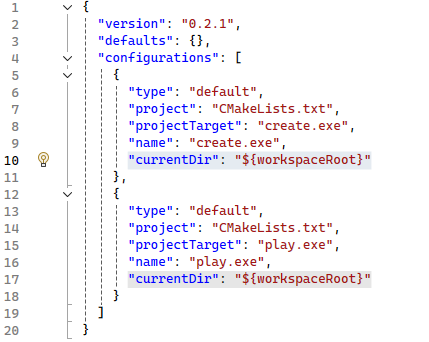
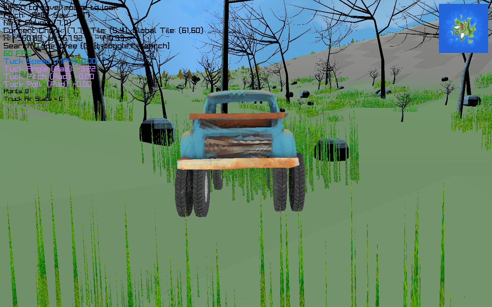
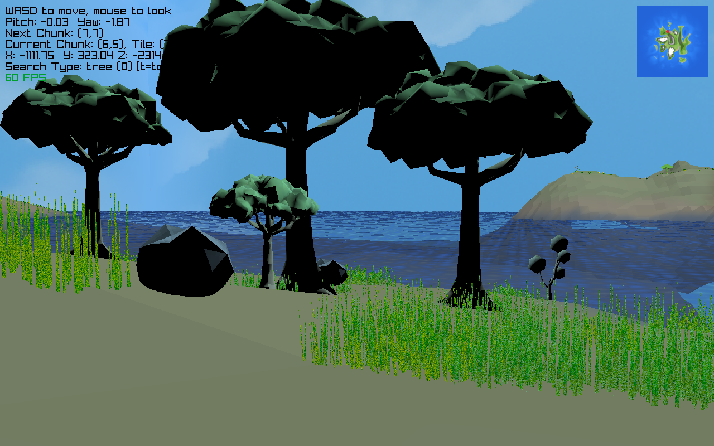
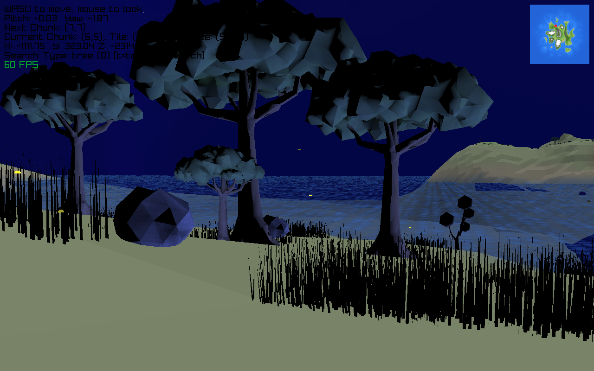
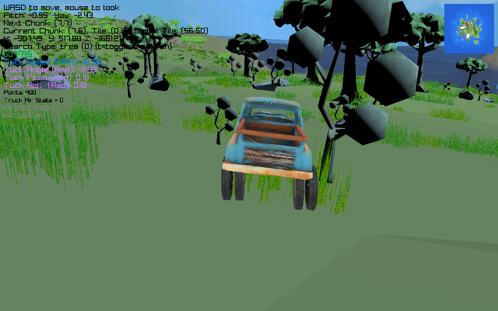

# MapBuilderWin

A raylib heightmap creation and preview program for specifically windows DEV.

Hey! Im Brandon. I just upgraded again to a Windows Gaming PC (because the rpi5 was getting maxed out performance wise)

Still a work in progress...

To run this with Visual Studio
	- View > Cmake Targets > Solution Explorer
	- for each exe (create and play) Add Debug Configuration
	- Will need to add to each section
		- "currentDir": "${workspaceRoot}"
		- 

--------------------------------------------------------------------------------------------------------

